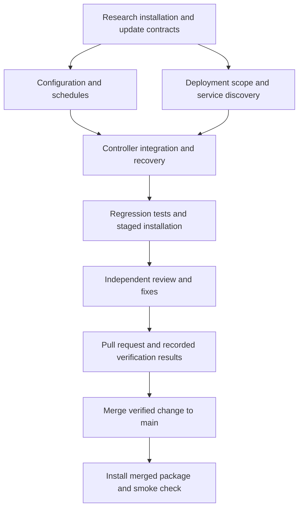

# Compatibility and verification notes

Research checked against upstream documentation and source on 2026-09-05.
The sources follow upstream `main`; the updater must inspect its frozen
candidate rather than assume those files never change.

## Installation contract

Hermes supports a command-line installation with features configured later.
Updating must not depend on provider credentials, a completed setup wizard,
a gateway, or a dashboard. This package targets Linux Git installations with
user systemd; supporting partial configuration does not imply support for every
operating system or package manager. The current deployment adapter expects
the Python environment at `<repository>/venv`.
[Upstream installation guide](https://hermes-agent.nousresearch.com/docs/getting-started/installation)

The default source checkout and data root are different paths. Both need
configuration, including corresponding service permissions. Upstream also
supports system-wide source locations and external development environments;
those layouts should not be advertised as tested by this package without
adapter coverage.
[Upstream development setup](https://hermes-agent.nousresearch.com/docs/developer-guide/contributing)

Profiles share source code and keep separate configuration and runtime state.
Profile selection can limit configuration maintenance and service restarts,
but cannot give profiles different versions of a shared checkout. Blank
profiles are valid, and custom skills must retain their contents.
[Upstream profiles guide](https://hermes-agent.nousresearch.com/docs/user-guide/profiles)

## Optional operations

Capture running services before promotion and retain that inventory during
recovery. An absent or stopped default gateway is not an installation failure.
Named gateways use `hermes-gateway-<profile>.service`; multiplexing can serve
several profiles through one gateway, so profile directories do not establish
which services should exist or run.
[Upstream gateway management](https://hermes-agent.nousresearch.com/docs/user-guide/multi-profile-gateways)

HTTP probes require an explicitly configured endpoint. The API server is
optional and normally uses port 8642; port 8644 is not a universal health
endpoint. A dashboard-only installation must not fail because no gateway is
running.
[Upstream API server](https://hermes-agent.nousresearch.com/docs/user-guide/features/api-server)

Source updates, Python dependencies, frontend assets, configuration migration,
and service restarts have different effects. Describe scope controls in those
terms. Refuse promotion when a required dependency or frontend change conflicts
with the selected scope; keep the installed checkout intact. Configuration
maintenance must preserve the user's choices and leave unconfigured profiles
unconfigured. Repair tooling is needed only when repair is enabled.
[Upstream update behavior](https://hermes-agent.nousresearch.com/docs/getting-started/updating)

## Candidate verification

Deployment scope controls changes to the installed system. It must not disable
checks for source included in the candidate. Current upstream uses fresh
processes per Python test file, a clean environment, bounded concurrency and
one retry. Integration, end-to-end and Docker suites have separate upstream
lanes. A run with no collected tests must not become a passing verification.
[Upstream test runner](https://github.com/NousResearch/hermes-agent/blob/main/scripts/run_tests_parallel.py)

Select the candidate's interpreter explicitly: upstream's shell wrapper can
fall back to an installed environment. An older installed version can update
to a candidate with the current runner. An older target without the runner
needs a supported verifier or a clear compatibility failure before promotion.
[Upstream test entry point](https://github.com/NousResearch/hermes-agent/blob/main/scripts/run_tests.sh)

Read optional Python extras from the candidate manifest. Request declared
verification extras without installing every possible backend. Upstream
deliberately keeps several platform-sensitive or optional dependencies out of
its `all` extra.
[Upstream Python manifest](https://github.com/NousResearch/hermes-agent/blob/main/pyproject.toml)

Discover Node checks and the web workspace from candidate manifests, retaining
checks for components that exist. Current upstream defines a workspace-wide
`check` script and a `web` workspace. Missing required tooling or an unsupported
manifest should be reported, never recorded as a passing check.
[Upstream Node manifest](https://github.com/NousResearch/hermes-agent/blob/main/package.json)

## Delivery task graph

The regression matrix covers a blank CLI installation, a named gateway without
the default gateway, dashboard-only operation, custom source and data paths,
disabled optional operations, required changes blocked by scope, repair without
Codex, explicit scheduling, reinstall preservation, and interrupted promotion.
Recovery must retain the selected scope and original running-service inventory.
Package installation and its smoke check verify package delivery; they do not
claim a complete upstream Hermes test run or an unattended Hermes update occurred.
